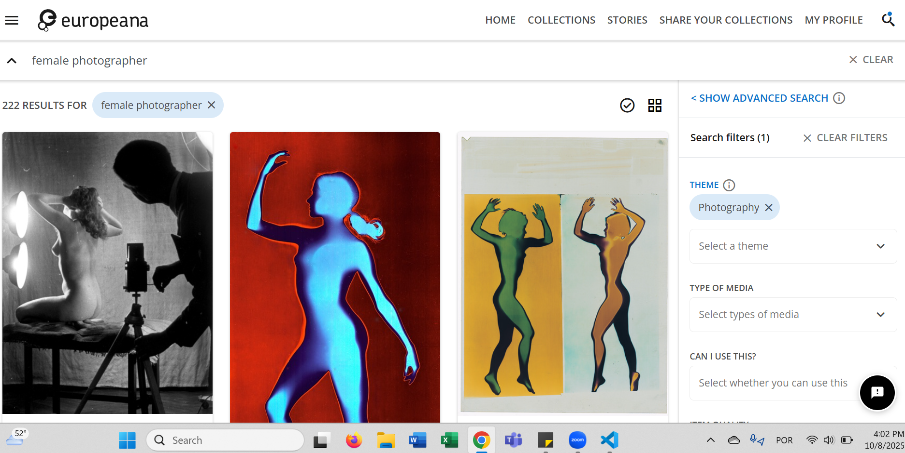

# Women in the early years of photography

## The Copyright Collection at The National Archives of the UK

I am an art historian who specializes in the history of photography, particularly in the early 20th century. As I was studying for my PhD, I very rarely came across women practicing photography during this period, except for some well-known names such as Julia Margaret Cameron and Anna Atkins. However, while reading newspapers and journals of the time, I realized that women were much more involved in photography than I was led to believe. I noticed that women not only worked as photographers but also owned or managed studios, edited and published journals, and organized clubs and events on photography.
Still, I usually find it difficult to locate women in photography as I search existing online databases. For example, these are the first results returned when searching the Europeana database for “female photographer”:

Example of the search results for "female photographer" in Europeana.

I knew that looking for similar terms would probably lead me to frustration. I needed a different strategy. One clue that I had from my readings was that during the turn of the 20th century women were often hired to made portraits of children.
I read a post on LinkedIn about the copyright records now at The National Archives of the UK. Starting in 1862, the Fine Arts Copyright Act required a system of registration of photographs and other visual materials, a system that lasted about 50 years. This collection is extremely useful for my research interest, as the images were submitted with forms that specify the copyright owner and copyright author, meaning that we can find information not only on photographers but also on studio owners.
The team at the Archives created a GitHub repository that explains more about the collection, and provides a roadmap for anyone who wants to start digging it (https://github.com/rae-drt/Copy1Hackathon).

## My search

I began by searching the online catalogue of the National Archives (https://discovery.nationalarchives.gov.uk/advanced-search) for keywords ‘child’ AND ‘photograph’ between year 1869 and 1920. The search returned a .csv table with 3,213 items. I then proceeded with some data cleaning using Python. I removed all items with mention of “Photographer: Uknown” and “Photographer(s): Unknown”, as well as items from the collection of Josefine Stross. Stross was a pediatrician and psychoanalyst who worked with children, not a photographer. I also removed items by Felice Beato, a well-known male photographer who appeared often in my search results. I converted the .csv table into a JSON object with keys for "Copyright owner of work," "Copyright author of work," "Photographer," "Photographer(s)," "Copyright owner and author of work," and "Copyright owner(s) and author(s) of work." As the Archives team notes, this information appears embedded mostly in the “Description” field, but I also checked the “Context Description” and “Title” fields.
After discarding items without reference to a photographer or copyright holder, I processed the list to begin locating female names. First, I filtered the list by checking for honorifics, such as “Mrs” and “Miss”, as these appeared often and provided consistent clues. Still, there were women who were mentioned without honorifics (for example, “Ruth Peacock”). To identify these names, I used a Python package called gender-guesser (https://pypi.org/project/gender-guesser/). I decided to filter only the first word that appeared on the “Photographer” or “Copyright owner” or “Copyright author” keys. I am aware that I probably missed some names, but it is a start. I combined the honorifics and name list, removing duplicates. I ended up with 226 items.

With a much smaller list, I was able to review it manually. The gender detector sometimes made mistakes (for example, the Marion Company appears numerous times). I then tabulated in a spreadsheet how many times a woman was mentioned, either as a photographer or copyright author, as a copyright owner, or both. I ended up with a list of 71 names, although some cases there might be a different spelling of the same name (f.ex., Guavier and Gravier, Jane Maria Bowkett and Jane Marie Borrkett).

My goal with this project was not to find every single mention of a woman in the National Archives collection, but to expand our knowledge of women practicing photography as a starting point for further research. The only names I recognized were Julia Margaret Cameron and Alice Hughes, but people who specialize in this context will likely identify more familiar names. Nevertheless, I suspect some of them are still not widely known.

# Dataset overview

<kbd></kbd> 

Fig. 3. Example of a catalogue record at The National Archives.
